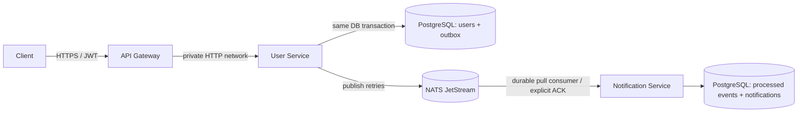

# Architecture

The only User Service → Notification Service integration is the `users.created` JetStream event. There is no REST or WebSocket connection between them.

## Delivery semantics

The User Service persists a user and an outbox record in one PostgreSQL transaction. A background publisher retries unpublished rows until JetStream confirms persistence. This prevents a successful user creation from losing its event if NATS is temporarily unavailable.

The Notification Service uses a durable pull consumer, explicit acknowledgements, redelivery (`max_deliver: 10`), and a `processed_events` unique key. It writes the idempotency record and notification in one database transaction, then ACKs. The system is therefore **at-least-once** across the broker and effectively-once for notification persistence.

## Security

- Gateway applies Helmet, payload limits, request IDs, rate limiting, JWT signing, and short upstream timeouts.
- User passwords are validated and hashed using bcrypt (cost 12); password hashes never leave the service.
- NATS authentication is required in local Compose. Production supports scoped NATS credentials (`NATS_CREDS_FILE`) and a CA bundle (`NATS_TLS_CA`) for TLS.
- Services are not published to host ports; the gateway is the only public application endpoint.
- Secrets are environment variables or container secrets, never source-controlled.
